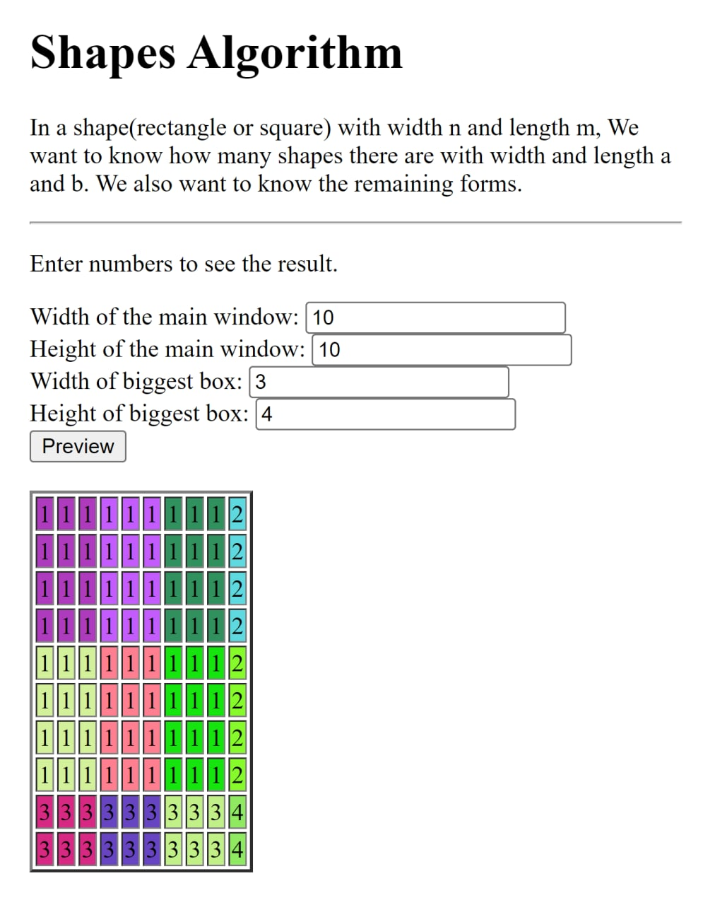

**Demo:** https://basemax.github.io/ShapesAlgorithm/demo.html

# Shapes Algorithm

## About the algorithm

In a shape(rectangle or square) with width `n` and length `m`, We want to know how many shapes there are with width and length `a` and `b`. We also want to know the remaining forms. For example, in the figure below, whose width and length are 10cm x 10cm, a shape with a width and length of 3 x 3 will be output as below:

- 9 items 3cm in 3cm (called G1)
- 3 items 1cm in 3cm (called G2)
- 3 items 3cm in 1cm (called G3)
- And a 1cm in 1cm item (called G4)
